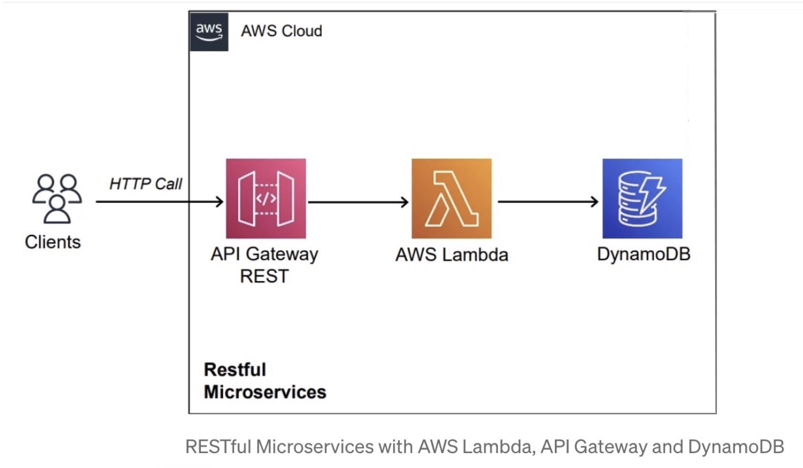
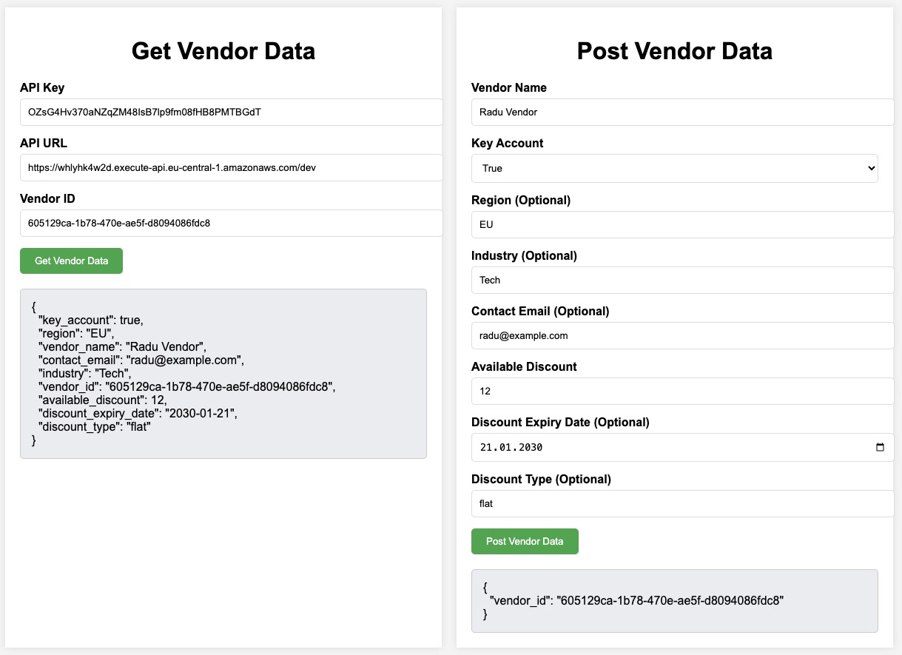

# Vendor API

## Architecture




## Installing Prerequisites

### AWS CLI

Check how to install and configure the AWS CLI [here](./docs/AWS_CLI.md).

### AWS SAM CLI

Check how to install and configure the AWS SAM CLI [here](https://docs.aws.amazon.com/serverless-application-model/latest/developerguide/install-sam-cli.html#install-sam-cli-instructions).

### Python
To install Python 3.13 on macOS:

```bash
brew install python@3.13
```

## Deploying using SAM

1. **Build**:
   ```bash
   sam build
   ```

2. **Deploy**:
   ```bash
   sam deploy
   ```

The script will deploy all the Lambdas, API Gateway and DynamoDB. After deployment, SAM will output the API endpoint, which is needed to make requests. 

## Checking Stack Status

You can check the AWS Console > CloudFormation to see the stack's status or use command below:
```bash
aws cloudformation describe-stacks --stack-name <STACK_NAME>
```

## Invoking the Seeder Function

To invoke the Seeder Lambda which inserts dummy data into both Vendors and Incentives tables please run the command below (output is logged to a file):

```bash
aws lambda invoke --function-name VendorSeederFunction output.txt
```

## Deleting a Stack via AWS CLI

If no longer needed, the stack can be removed easily via the CLI:

```bash
aws cloudformation delete-stack --stack-name <your-stack-name>
```

# API Endpoint Documentation

## Endpoint: `GET /vendor/{vendor_id}`

This endpoint retrieves the details of a specific vendor and its associated incentive data based on the provided `vendor_id`.

---

### **Request**

**Method:** `GET`

**Path Parameters:**
- `vendor_id` (string, required): The unique identifier of the vendor.

**Example Request:**
```
GET /vendor/12345
```

---

### **Response**

#### Success (Status Code: `200 OK`)

**Response Body (JSON):**
```json
{
  "vendor_id": "12345",
  "vendor_name": "Example Vendor",
  "key_account": "123456",
  "region": "North America",
  "industry": "Technology",
  "contact_email": "contact@example.com",
  "available_discount": 10.0,
  "discount_type": "percentage",
  "discount_expiry_date": "2025-12-31"
}
```

## Endpoint: `POST /vendor`

This endpoint allows users to create a new vendor and its associated incentive data.

---

### **Request**

**Method:** `POST`

**Request Body (JSON):**
- `vendor_name` (string, required): The name of the vendor.
- `key_account` (string, required): A key account identifier associated with the vendor.
- `region` (string, optional): The region in which the vendor operates.
- `industry` (string, optional): The industry to which the vendor belongs.
- `contact_email` (string, optional): Contact email address for the vendor.
- `available_discount` (float, required): The discount amount available for the vendor.
- `discount_type` (string, optional): The type of discount (e.g., "percentage", "fixed").
- `discount_expiry_date` (string, optional): Expiry date for the discount (in YYYY-MM-DD format).

**Example Request Body:**
```json
{
  "vendor_name": "Example Vendor",
  "key_account": "123456",
  "region": "North America",
  "industry": "Technology",
  "contact_email": "contact@example.com",
  "available_discount": 10.0,
  "discount_type": "percentage",
  "discount_expiry_date": "2025-12-31"
}
```

---

### **Response**

#### Success (Status Code: `201 Created`)

**Response Body (JSON):**
```json
{
  "vendor_id": "new-unique-vendor-id"
}
```

- `vendor_id`: The unique identifier for the newly created vendor. This ID is automatically generated and returned.


# Manually Testing the API

1. **Create Vendor using cURL request:**

    ```bash
    curl -X POST https://<api_root_url>/vendor \
    -H "x-api-key: YOUR_API_KEY" \
    -H "Content-Type: application/json" \
    -d '{
        "vendor_name": "TechCorp",
        "key_account": true,
        "region": "USA",
        "industry": "Technology",
        "contact_email": "contact@techcorp.com",
        "available_discount": 15,
        "discount_type": "percentage",
        "discount_expiry_date": "2025-12-31"
    }'
    ```

2. **Read Vendor Data using cURL request:**
    ```bash
    curl -X GET https://<api_root_url>/vendor/{vendor_id} \
    -H "x-api-key: YOUR_API_KEY"
    ```

3. **(Optional) View Vendor Data Using the UI:**

    1. **Start the Server**  
    In your terminal, navigate to the `client` directory and run the following command to start the server:
        ```bash
        cd client
        python3 -m http.server 8000
        ```

    2. **Access the UI**  
    Open your browser and navigate to http://localhost:8000.  
    Enter the **API Key**, **API URL**, and **Vendor ID**, then click **Get Vendor Data** to retrieve the vendor details.

        

# Thank you for your time and attention! 🙂
